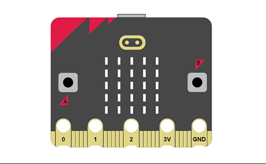

# Introduction 0.01 - Microbit Basics

{ align=right }

The micro:bit is a small microcontroller that can be programmed in a huge variety of ways to create exciting projects. The micro:bit can be programmed using a very simple coding environment called MakeCode. This worksheet will guide you through the micro:bit and MakeCode.

This worksheet introduces students to the Microbit microcontroller.

[Student Worksheet]({{ bmlgithubpages }}/introduction/Introduction 0.01 - Microbit Basics/Introduction 0.01 - Microbit Basics.pdf)

