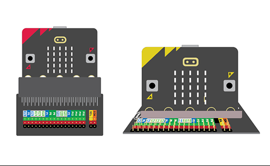

# Introduction 0.02 - Microbit Expansion

{ align=right }

The real power of the micro: bit is in the “pins” that are the gold contacts on the edge of the board.  These 25 pins allow you to connect a variety of components to the micro:bit.  This worksheet shows you how.

This worksheet explains how the 'pins' on the Microbit can be used to expand the possibilities of the Microbit.

[Student Worksheet]({{ bmlgithubpages }}/introduction/Introduction 0.02 - Microbit Expansion/Introduction 0.02 - Microbit Expansion.pdf)

