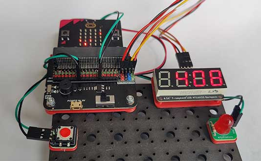

# Project 4.01 - Build a Reaction Game

{ align=right }

THIS WORKSHEET IS IN PROGRESS.

In this project you will build a simple electronic game. But it won't be screen-based!
You will construct it from various components and use a Microbit to code how the
game behaves.

[Student Worksheet]({{ bmlgithubpages }}/projects/Project 4.01 - Build a Reaction Game/Project 4.01 - Build a Reaction Game.pdf)

[Code Solutions]({{ bmlgithub }}/projects/Project 4.01 - Build a Reaction Game/code)