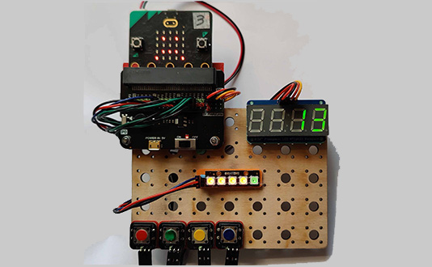

# Project 4.02 - Build a Colour Reaction Game

{ align=right }

THIS WORKSHEET IS IN PROGRESS.

In this project you will build an electronic game using various components and code a Microbit to control how the game behaves.

The game will show the player different coloured lights.  The player must press the button matching the colour shown.  If they press the button in time, they get a point.

[Student Worksheet]({{ bmlgithubpages }}/projects/Project 4.02 - Build a Colour Reaction Game/Project 4.01 - Build a Reaction Game.pdf)

[Code Solutions]({{ bmlgithub }}/projects/Project 4.02 - Build a Colour Reaction Game/code)