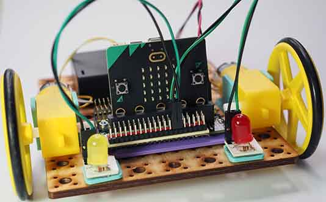

# Project 1.02 - Add Lights to your Robot

{ align=right }

In this project you will add lights to the robot you previously made.

Adding lights will extend your digital making skills by teaching you about digital outputs and LEDs.

[Student Worksheet]({{ bmlgithubpages }}/projects/Project 1.02 - Add Lights to your Robot/Project 1.02 - Add Lights to your Robot.pdf){ target=_blank }

[Tutor Notes]({{ bmlgithubpages }}/projects/Tutor Notes 01 - Wheeled Robots/Tutor Notes - Projects 1.00 - Wheeled Robots.pdf)

[Code Solutions]({{ bmlgithub }}/projects/Project 1.02 - Add Lights to your Robot/code)