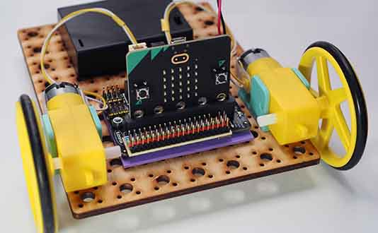

# Project 1.03 - Add Crash Sensors to your Robot

{ align=right }

In this project you will add some crash sensors to your robot.

These will detect when the robot has crashed into a wall or another robot. You can use these to take evasive action, such as turning around or making a noise.

[Student Worksheet]({{ bmlgithubpages }}/projects/Project 1.03 - Add Crash Sensors to your Robot/Project 1.03 - Add Crash Sensors to your Robot.pdf)

[Tutor Notes]({{ bmlgithubpages }}/projects/Tutor Notes 01 - Wheeled Robots/Tutor Notes - Projects 1.00 - Wheeled Robots.pdf)

[Code Solutions]({{ bmlgithub }}/projects/Project 1.03 - Add Crash Sensors to your Robot/code)
