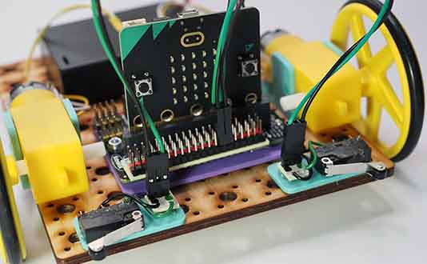

# Project 1.04 - Build a Remote Control Robot

{ align=right }

In this workshop you will make a remote controller which can be used to control the robot you built in a previous workshop.

For the remote control you will need another Microbit. So you will have two Microbits, one in the controller and one in the robot. We will use the radio feature of the Microbit to send messages from the controller to the robot.

[Student Worksheet]({{ bmlgithubpages }}/projects/Project 1.04 - Build a Remote Control Robot/Project 1.04 - Build a Remote Control Robot.pdf)

[Tutor Notes]({{ bmlgithubpages }}/projects/Tutor Notes 01 - Wheeled Robots/Tutor Notes - Projects 1.00 - Wheeled Robots.pdf)

[Code Solutions]({{ bmlgithub }}/projects/Project 1.04 - Build a Remote Control Robot/code)