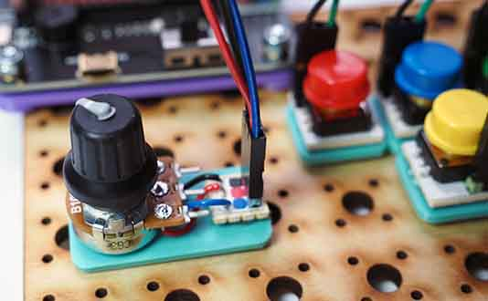

# Project 1.05 - Add a Speed Control to your Remote

{ align=right }

In this project you will add a speed control to your remote controller.

For the speed control you will add a potentiometer to the remote control. This is an analogue input device. By turning the knob, you can get different values from 0 to 100 which can be used to set the speed. When we read the value from the potentiometer on the controller, we need to send the value across to the robot, so it can adjust its speed.

[Student Worksheet]({{ bmlgithubpages }}/projects/Project 1.05 - Add a Speed Control to your Remote/Project 1.05 - Add a Speed Control to your Remote.pdf)

[Tutor Notes]({{ bmlgithubpages }}/projects/Tutor Notes 01 - Wheeled Robots/Tutor Notes - Projects 1.00 - Wheeled Robots.pdf)

[Code Solutions]({{ bmlgithub }}/projects/Project 1.05 - Add a Speed Control to your Remote/code)