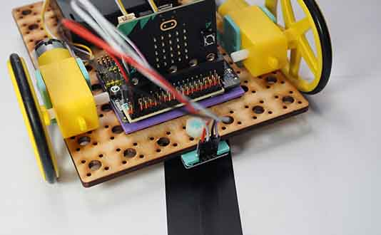

# Project 1.06 - Build a Line Following Robot

{ align=right }

In this project you will make robot that can follow a black line on the floor.

You will attach a line following sensor to the underside of your robot. You will then write some code that uses the line sensor to detect when the robot is on the line.

[Student Worksheet]({{ bmlgithubpages }}/projects/Project 1.06 - Build a Line Following Robot/Project 1.06 - Build a Line Following Robot.pdf)

[Tutor Notes]({{ bmlgithubpages }}/projects/Tutor Notes 01 - Wheeled Robots/Tutor Notes - Projects 1.00 - Wheeled Robots.pdf)

[Code Solutions]({{ bmlgithub }}/projects/Project 1.06 - Build a Line Following Robot/code)