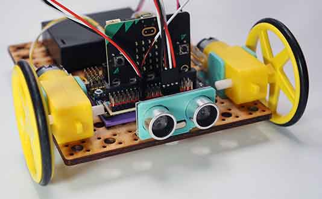

# Project 1.07 - Build an Obstacle Avoiding Robot

{ align=right }

In this project you will make a robot that moves randomly around the room avoiding crashing into walls and other obstacles in its path.

You will attach an ultrasonic sensor to the front of your robot. This can detect the distance to the nearest obstacle. You will then write some code to use this information to avoid crashes.

[Student Worksheet]({{ bmlgithubpages }}/projects/Project 1.07 - Build an Obstacle Avoiding Robot/Project 1.07 - Build an Obstacle Avoiding Robot.pdf)

[Tutor Notes]({{ bmlgithubpages }}/projects/Tutor Notes 01 - Wheeled Robots/Tutor Notes - Projects 1.00 - Wheeled Robots.pdf)

[Code Solutions]({{ bmlgithub }}/projects/Project 1.07 - Build an Obstacle Avoiding Robot/code)