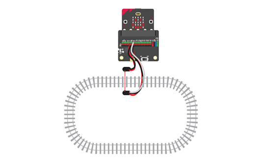

# 2.05 - Build a Signalling System for Trains

{ align=right }

In this project you will create a signalling system that can automatically control trains on complex track systems.

You will attach a break-beam sensor to the track. This will detect when a train has entered a particular part of the track so that multiple trains can be controlled to safely move along the track.

[Student Worksheet]({{ bmlgithubpages }}/projects/Project 2.05 - Build a Signalling System for Trains/Project 2.05 - Build a Signalling System for Trains.pdf)

[Code Solutions]({{ bmlgithub }}/projects/Project 2.05 - Build a Signalling System for Trains/code)