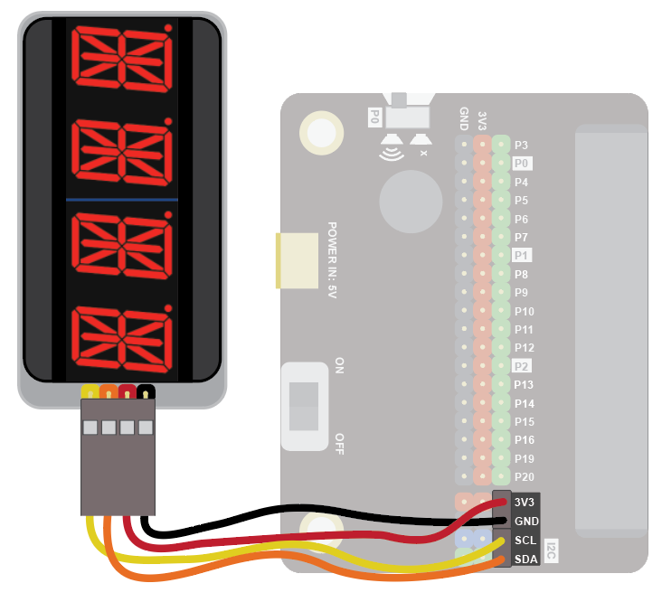
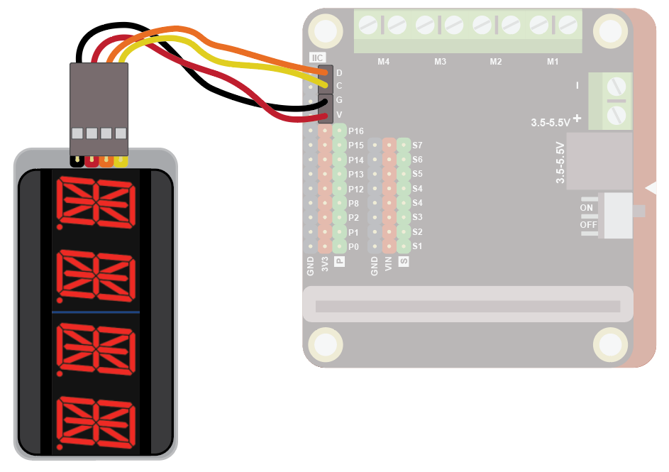
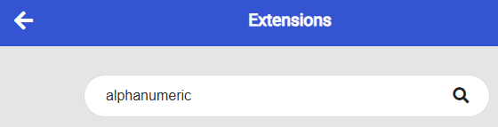
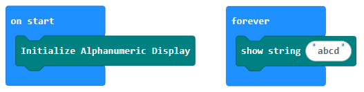
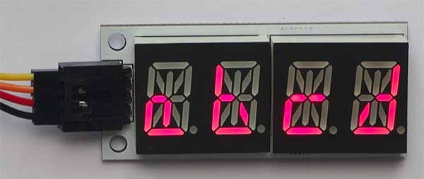

### Alphanumeric sensor
The alphanumeric LED can be used to display up to 4 characters (letters or numbers).

Use it to display short messages, counters, and much more!

### Quick Reference
These instructions work with the Elecfreaks alphanumeric display, but not with the Adafruit ones.

### Wiring
Use the I2C cable to connect the sensor. This has 4 wires in 2 pairs: orange-yellow and red-black:

Wire up as follows, using the Edge Connector or Motor Controller board:

| Alphanumeric Display | Suggested wire colour | Edge Connector | Motor Controller |
| :------------------- | :-------------------- | :------------- | :--------------- |
| VCC                  | Red                   | 3V3            | V                |
| GND                  | Black                 | GND            | G                |
| SCL                  | Yellow                | SCL            | C                |
| SDA                  | Orange                | SDA            | D                |

On the edge connector it should look like this:

On the motor controller it should look like this:

#### Coding
You will need to add an extension to get additional blocks for the display. Click on the extensions block:

Then search for "lcd":

Then click on the i2cLD1602 extension:

You should see a new block appear:

Enter this code in on start and forever blocks:

Download the code to the microbit.

The code shows a simple message:

 