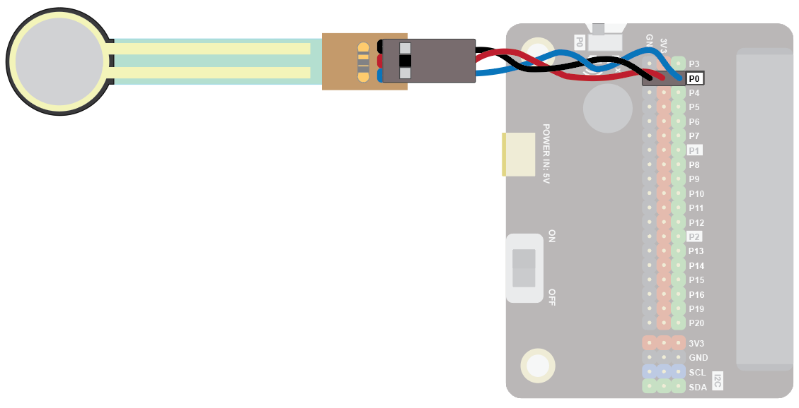
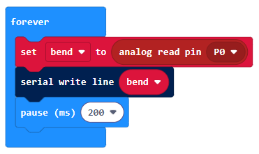
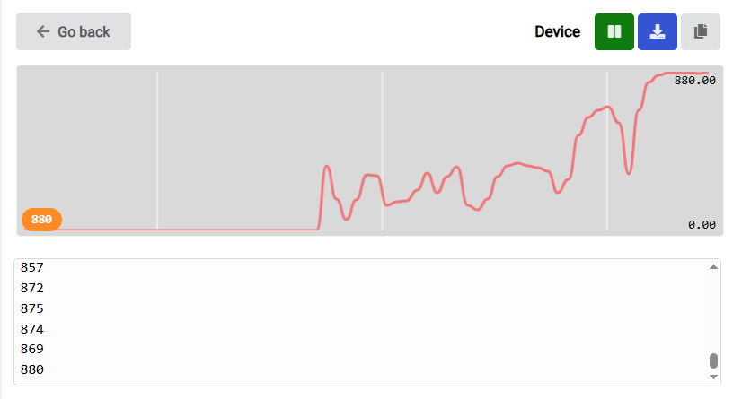
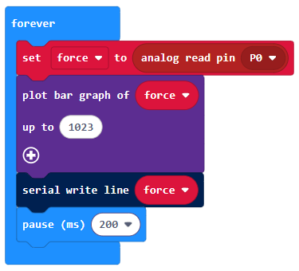
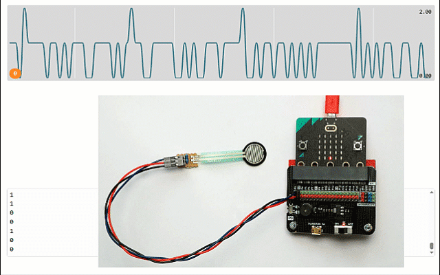

### Force Sensor
The force sensor can be used to sense the amount of physical pressure being applied to it. This force could be from a finger pressing on it, or a weight placed on it.

Use it detect when an object is placed on it, or as a force-sensitive button, and much more!

### Quick Reference
### Wiring
Use a GVS cable to connect the sensor. This has 3 wires, blue, red and black:

Wire up as follows, using the Edge Connector or Motor Controller board:

+----------------------+----------------------+
| Force Sensor         | Microbit             |
+----------------------+----------------------+
| 3-pin connector     | P0 3-pin connector   |
+----------------------+----------------------+

You don't have to use pin P0. You can use any analogue pin. Just remember to adjust your code accordingly.

Coding
Enter this code in forever:

The Serial blocks can be found in Advanced.

Download the code to the microbit.

To see the data, click on Show data Device:

You should see some numbers and a graph. These show the amount of bend:

Press the sensor and watch the values change. Don't dig into the sensor with anything sharp (like your fingernail) or you will damage the sensor.

You can use the force value to control other things. For example, in the code below, we can use this to control the bar graph function of the Microbit:

The plot bar graph block plots the force value as a bar chart on the LED display:

 