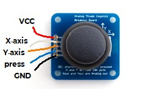
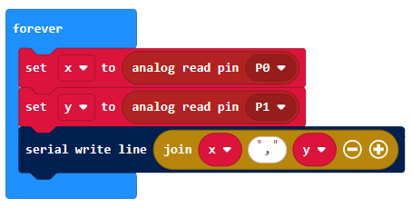
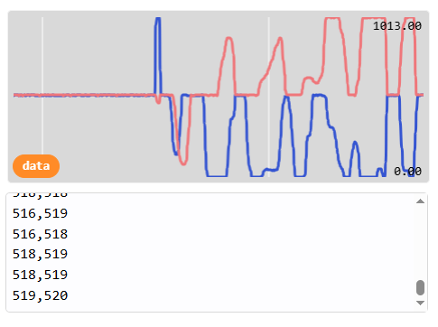

### Joystick
A joystick generally provides two analogue inputs, representing the x and y axes.
Use it to build a remote control for a robot or game and much more!

### Quick Reference
### Wiring
Most joysticks work in the same way. There are power inputs (GND and 3V) and analgoue inputs for the x and y axes. Some joysticks also have a button that you can press, and this is read through an additional digital joystick.

Wire up as follows, using the Edge Connector or Motor Controller board:

+----------------------+--------------------------------------+
| Joystick             | Microbit                             |
+----------------------+--------------------------------------+
| VCC                  | 3V                                   |
| GND                  | GND                                  |
| X-axis               | P0 (or another analogue pin)         |
| Y-axis               | P1 (or another analogue pin)         |
| press                | P8 (or another digital pin)         |
+----------------------+--------------------------------------+

You don't have to use pins P0 and P1. You can use any analogue pins for the x and y axes. Just remember to adjust your code accordingly.

Coding
Enter this code in forever:

The Serial blocks can be found in Advanced.

Download the code to the microbit.

To see the data, click on Show data Device:

You should see some pairs of numbers and a graph. Eacy pair shows the x and y axis value, which generally range from -1023 to +1023. Push the joystick in different directions and watch the values change:

You can use these values to control other things. For example, you could use the y axis to control the speed of a robot and the x axis to control the left-right movement.

 