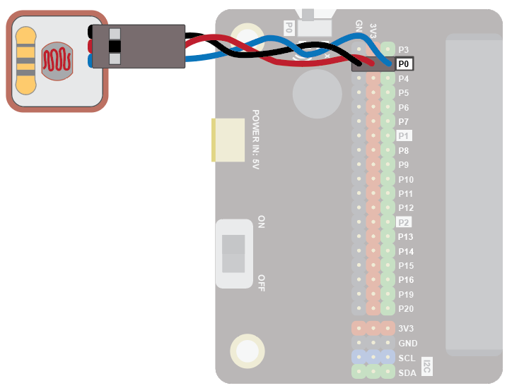
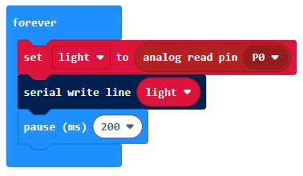
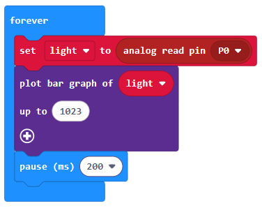
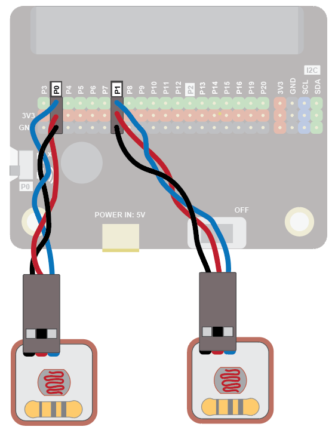
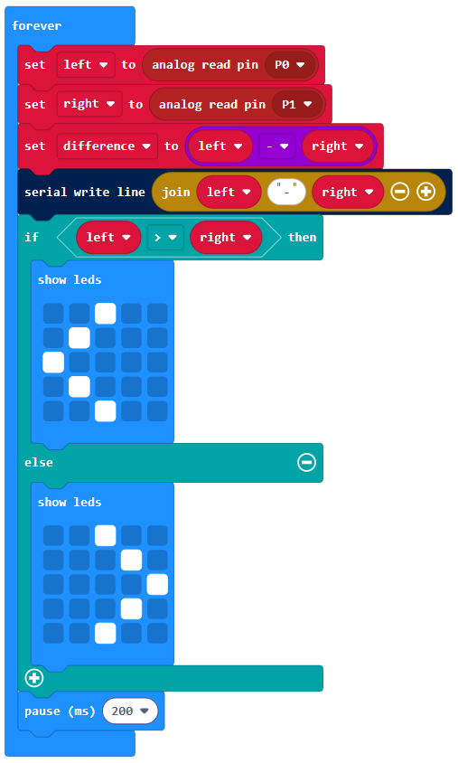
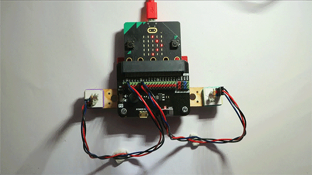

### Light Sensor
The light sensor can be used to detect the amount of light falling on it.

Use it to turn on an LED when it gets dark, or use two to get a robot to follow a torch!

#### Quick Reference
### Wiring
Use a GVS cable to connect the sensor. This has 3 wires, blue, red and black:

Wire up as follows, using the Edge Connector or Motor Controller board:

+----------------------+----------------------+
| Light Sensor         | Microbit             |
+----------------------+----------------------+
| 3-pin connector      | P0 3-pin connector   |
+----------------------+----------------------+

Make sure you connect the cable the right way round, with the black wire connecting to the black pin on both ends.

On the edge connector it should look like this:

You don't have to use pin P0. You can use any analogue pin. Just remember to adjust your code accordingly.

#### Basic Coding
Enter this code in forever:

The Serial blocks can be found in Advanced.

Download the code to the microbit.

To see the data, click on Show data Device:

You should see some numbers and a graph. These show the amount of light falling on the sensor:

Shield the sensor with your hand and match the values change.

You can use the light level to control other things. For example, in the code below we use the light level to control the bar graph function of the Microbit:

Detecting Light Direction with Two Light Sensors
Things get more interesting when you use two light sensors. Here, an additional sensor has been added to pin P1:

The difference between the light levels recorded by the two sensors gives you an indication of the direction of the light. This has many interesting applications. For example, you can attach two light sensors to the front of a robot and use the detected light direction to get the robot to move towards the light.

This code shows an arrow to indicate the direction the light is coming from:

Here is what it looks like when a torch is moved over the two sensors:

 