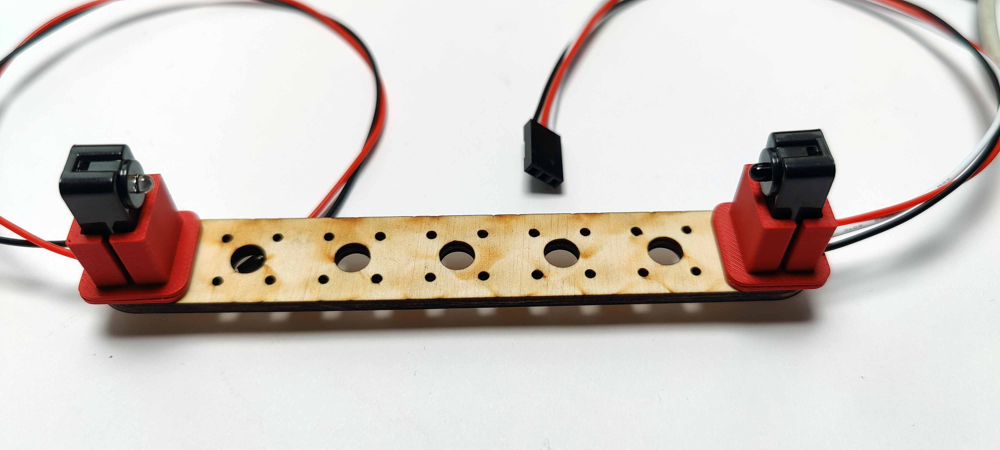
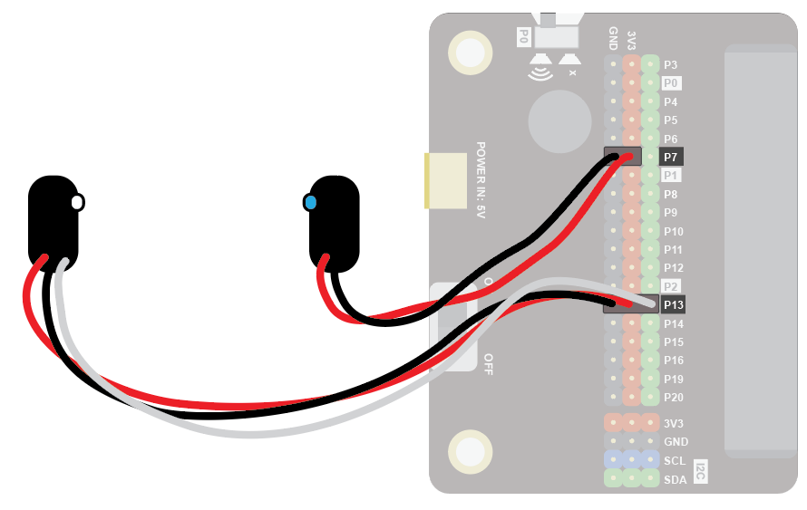
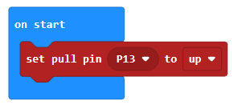
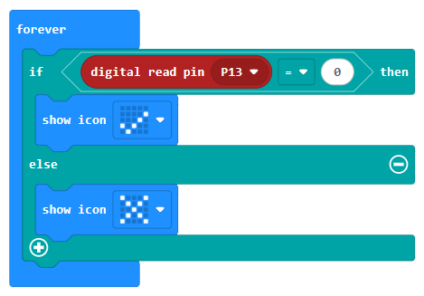
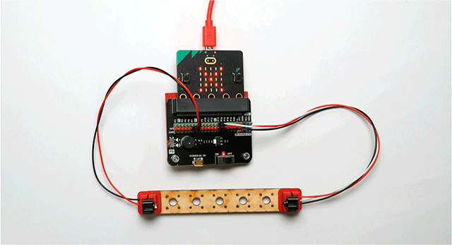

### break beam sesnor
The break beam sensor can be used to detect an object entering a specific place.

Use it to detect vehicles crossing a line, intruders in your space, and much more!

### Tutorial
Watch this video for a complete tutorial:

#### Quick Reference
### Wiring
Position the IR LED and the IR sensor so they face each other:

Wire up as follows, using the Edge Connector or Motor Controller board:

| Component             | micro:bit Connection              |
| :-------------------- | :-------------------------------- |
| Break Beam Sensor     | micro:bit                         |
| Sensor (with 3 wires) | P13 3-pin connector               |
| LED (with 2 wires)    | Any GND and 3V3 pins, e.g. on P7 |

Make sure you connect the cables the right way round, with the black wire connecting to the black pin and the red wire connecting to a red pin for both parts. The white wire will connect to a green pin on the Microbit board.

You don't have to use pin P13. You can use any digital pin. Just remember to adjust your code accordingly.

Coding
Enter this code in on start:

Enter this code in forever:

Download the code to the microbit.

Test with the beam unbroken (you should see a cross) and broken (you should see a tick):

Note: Using the sensor in bright sunlight can lead to false readings.
 