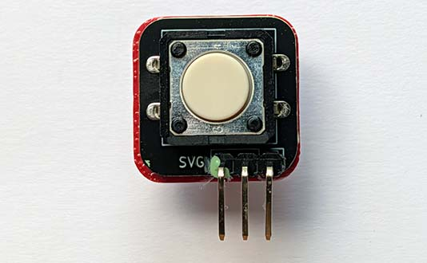
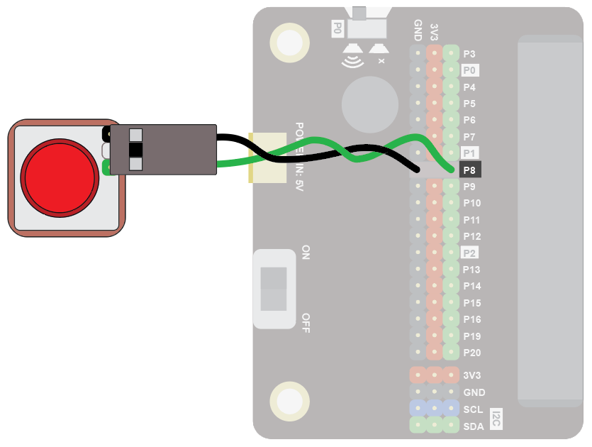
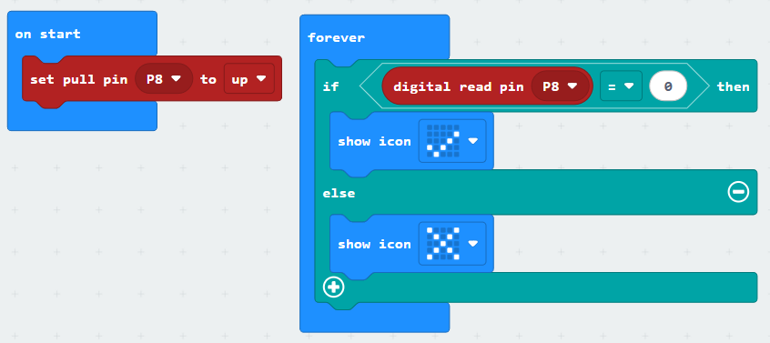
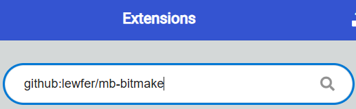
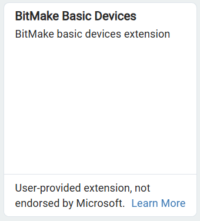
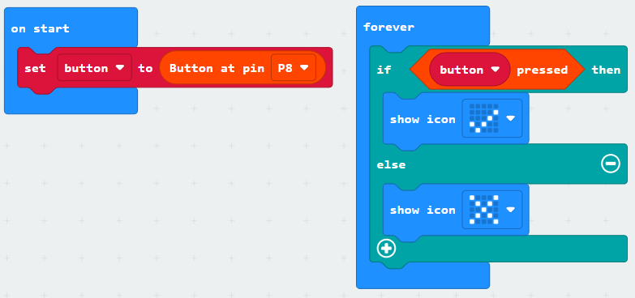
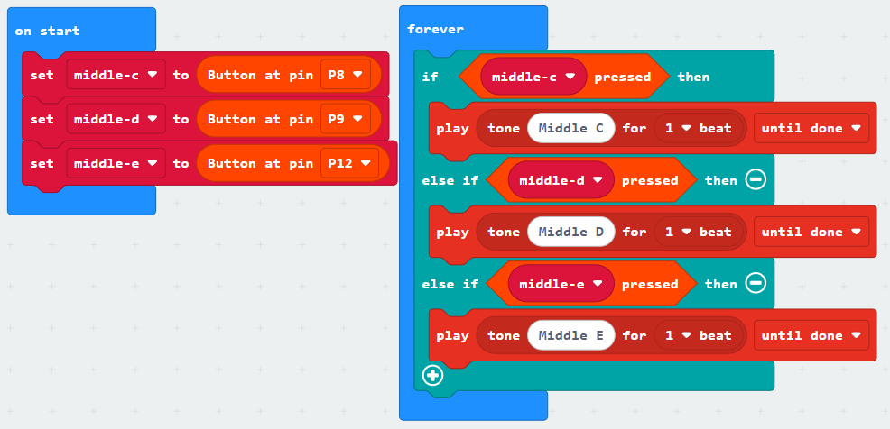

A button provides a digital input.  

Buttons and switches come in various shapes and sizes.  The one shown here is called a "momentary switch".  It is on when pressed and off when not pressed.

## Wiring
Use a GS cable to connect the button.  This has 2 wires, green and black:

{ width=400 }

Wire up as follows, using the Edge Connector or Motor Controller board:

|Button   | Microbit             |
| :-------------- | :------------------  |
|3-pin connector  | P8 3-pin connector   |

{ width=600 }

You don't have to use pin P8.  You can use any <a href="../../../assets/pins-short.png" target="_blank">digital pin</a>.  Just remember to adjust your code accordingly.

## Coding

Enter this code:

The block **set pull pin P8 to up** ensures the default state of the pin is the value 1.  When the button is pressed, the value of the pin goes to 0. 

Download the code to the microbit.

The display should show an X.  When you press the button, it should show a tick.

## Coding with the Bitmake extension
The bitmake extension makes it a bit easier to work with buttons and other basic devices.

To add the extension, first click on Extensions:

{ width=400 }

Then enter the URL for the extension:

Then click on the extension:

You should see the following block:

Enter the following code:

Download the code to the microbit.

It will work in the same way as the previous code.  The benefit of using the extension is that controlling multiple buttons is neater.  For example, in the code below three buttons are set up.  The button variables are given clear names: middle-c, middle-d and middle-e, which correspond to the musical notes.  It's easy to see which buttons should play which notes:

There are a number of code blocks in the Bitmake extension that can help you in your projects:

