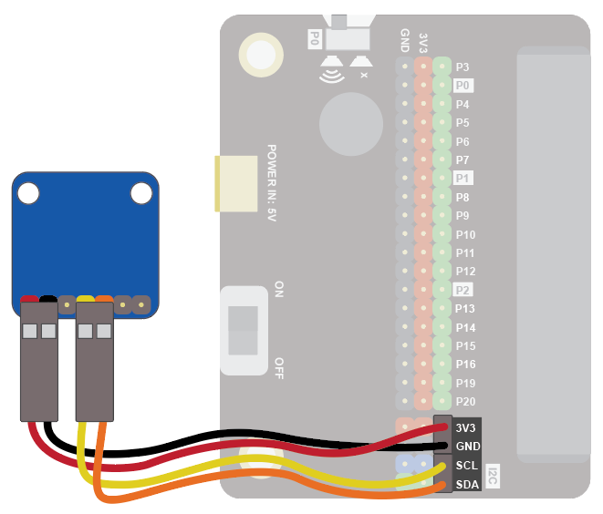
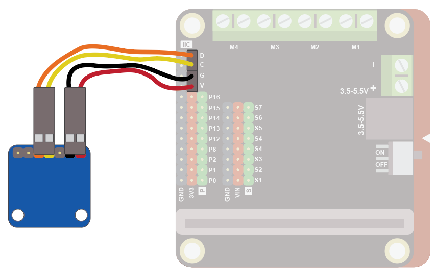
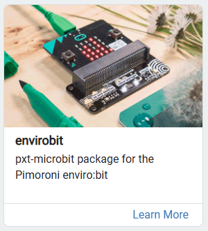
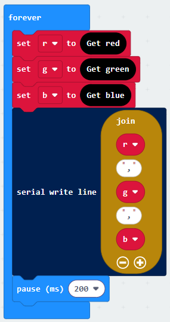
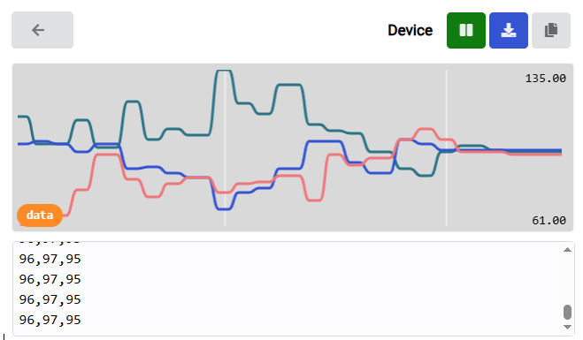
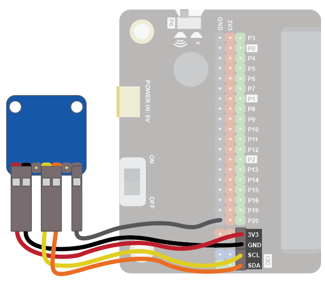

The colour sensor can be used to detect the colour of an object.

Use it to sort coloured objects, detect when fruit is ripe, and much more!

These instructions work with the Adafruit TCS34725 colour sensor.  For more details on this sensor see <a herf="https://learn.adafruit.com/adafruit-color-sensors/overview" target="_blank">here</a>.

## Wiring
Use the I2C cable to connect the sensor.  This has 4 wires in 2 pairs: orange-yellow and red-black:

{ width=400 }

Wire up as follows, using the Edge Connector or Motor Controller board:

|Colour Sensor      | Wire colour | Edge Connector | Motor Controller |
| :---------------- | :-------------------- | :------------- | :--------------- |
|VIN                | Red                   | 3V3            | V                |
|GND                | Black                 | GND            | G                |
|SCL                | Yellow                | SCL            | C                |
|SDA                | Orange                | SDA            | D                |

On the edge connector it should look like this:

{ width=600 }

On the motor controller it should look like this:

{ width=600 }

## Coding

You will need to add an extension to get additional blocks for the display.  The envirobit extension from Pimoroni is for their envirobit device, which has a colour sensor.  We can use this extension to control our colour sensor.  Click on the extensions block:

Then search for "enviro":

Then click on the **envirobit** extension:

You should see a new block appear:

Enter this code in the **forever** block:

Download the code to the microbit.

Colours are defined by the amount of red, green and blue detected.  The above code reads each of these components and sends the data to the serial port.

To see the data, click on Show data Device:

You should see some numbers and a graph. These show the colour components.  Place different coloured objects about 1cm in front of the sensor.  The colour components detected will change accordingly:

##### Notes
If you are detecting the colour of a light source (like an lamp) you will want to turn off the LED on the colour sensor, so the sensor can detect the light coming from the item being sensed.  To do this, attach an additional wire to the LED pin on the sensor and to and GND on the Microbit:

{ width=600 }

 
