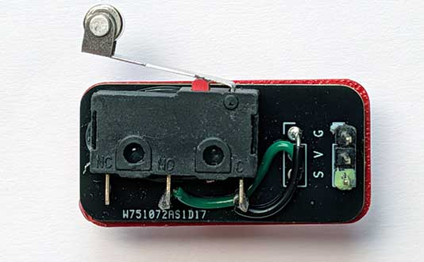
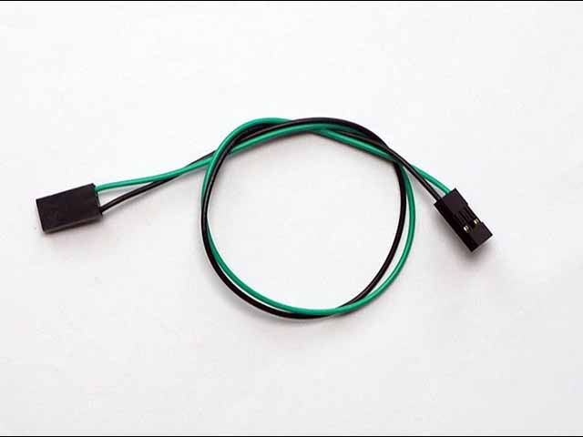
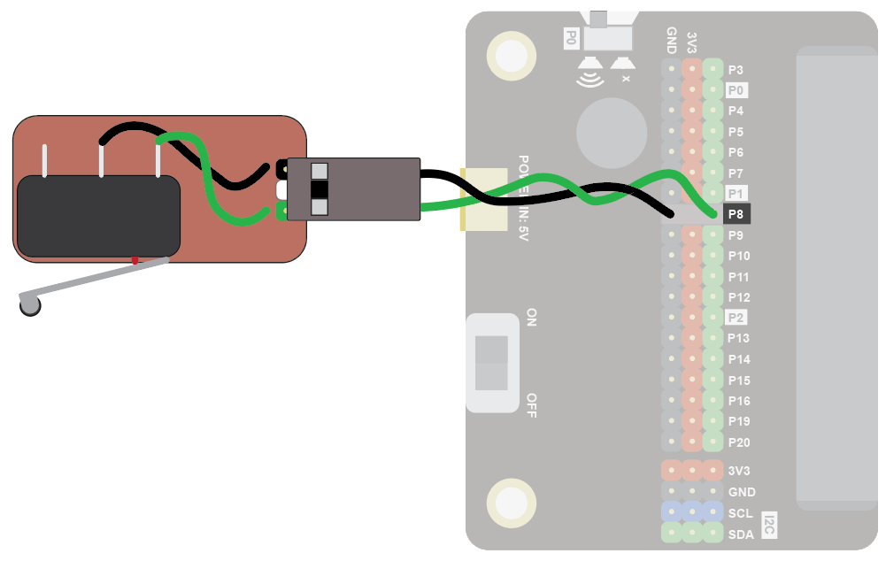
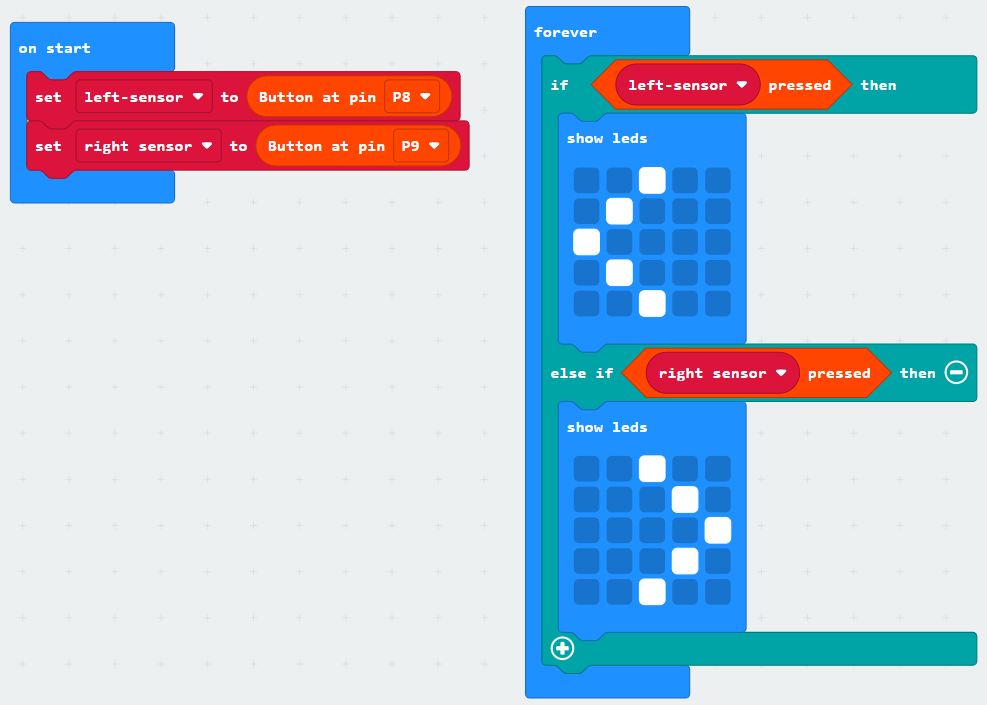
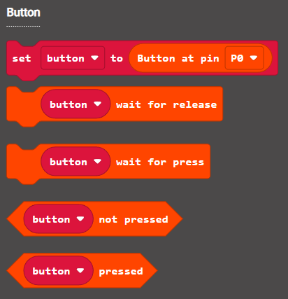

A crash sensor provides a digital input.  

Crash sensors are used to detect when something hits another thing.  You can use them to detect when a robot crashes into a wall, or when some moving part tries to move to somewhere it shouldn't.  For example, crash sensors are used on printers, to detect when the moving print head reaches then end of the printer.

## Wiring
Use a GS cable to connect the sensor.  This has 2 wires, green and black:

{ width=400 }

Wire up as follows, using the Edge Connector or Motor Controller board:

|Crash Sensor   | Microbit             |
| :-------------- | :------------------  |
|3-pin connector  | P8 3-pin connector   |

{ width=600 }

You don't have to use pin P8.  You can use any <a href="../../../assets/pins-short.png" target="_blank">digital pin</a>.  Just remember to adjust your code accordingly.

## Coding

Enter this code:

The block **set pull pin P8 to up** ensures the default state of the pin is the value 1.  When the button is pressed, the value of the pin goes to 0. 

Download the code to the microbit.

The display should show an X.  When you press the crash sensor, it should show a tick.

## Coding with the Bitmake extension
The bitmake extension makes it a bit easier to work with crash sensors and other basic devices.  You can use the button blocks to work with crash sensors.

To add the extension, first click on Extensions:

{ width=400 }

Then enter the URL for the extension:

Then click on the extension:

You should see the following block:

Enter the following code:

Download the code to the microbit.

It will work in the same way as the previous code.  The benefit of using the extension is that controlling multiple buttons is neater.  For example, in the code below two crash sensors are set up, one on the left and one on the right.  The button variables are given clear names: left-sensor and right-sensor, which correspond to the position of the sensor (for example, this might be on a robot).  It's easy to see which crash sensor is triggered:

There are a number of code blocks in the Bitmake extension that can help you in your projects:

