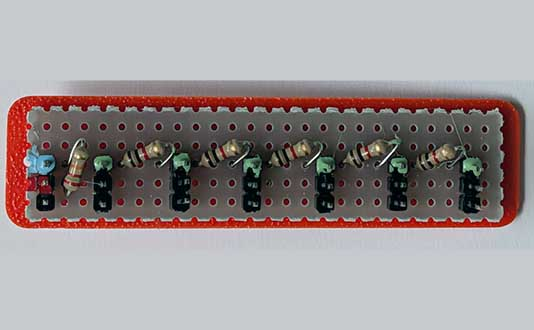
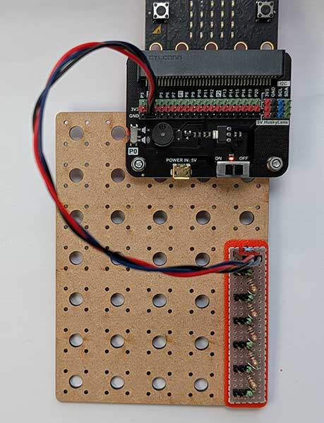
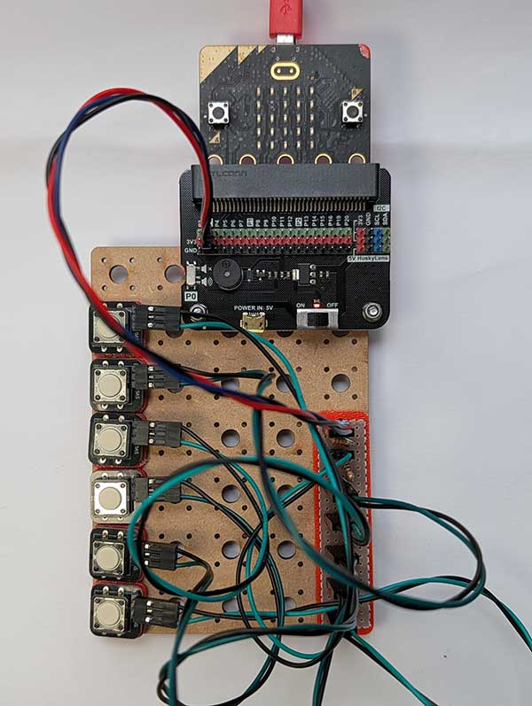
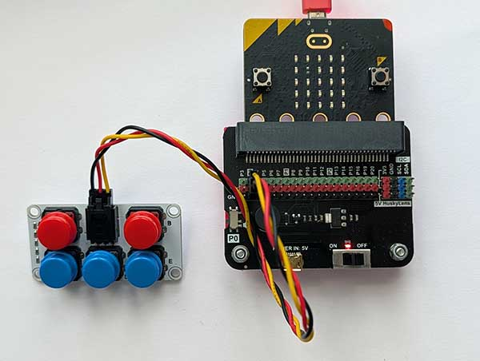
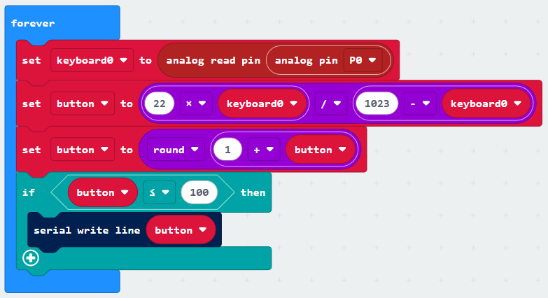
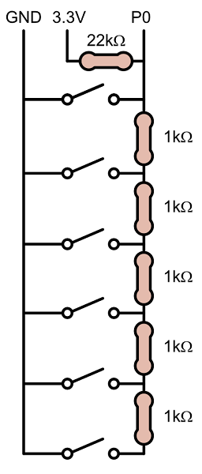

### Keyboard
When you need lots of buttons in your project, you can soon run out of digital pins.

The keyboard connector allows you to connect multiple buttons to a single **analogue** pin.

#### Wiring
Use a GVS cable to connect the keyboard connector to an analogy pin.  The GVS cable has 3 wires, blue, red and black:

{ width=400 }

Connect up as follows, using the Edge Connector or Motor Controller board:

|Potentiometer   | Microbit             |
| :-------------- | :------------------  |
|3-pin connector  | P0 3-pin connector   |

Connect the blue wire to the blue pin.

You don't have to use pin P0.  You can use any <a href="../../../assets/pins-short.png" target="_blank">analogue pin</a>.  Just remember to adjust your code accordingly.

Then connect buttons to the keyboard connector.  The standard keyboard connector allows up to 6 buttons to be connected:

{ width=600 }

It's possible to make a keyboard connector with many more buttons.  Up to 20 should work well.  But this will require a lot of resistors and some soldering!

You can also use the 5-button ADKeypad from Elekfreaks.  Connect it as follows:

{ width=600 }

#### Coding

Enter this code in **forever**:

The Serial blocks can be found in Advanced.

Download the code to the microbit.

To see the data, click on Show data Device:

Press each button in turn.  You should see the button number appear.

#### How it works
The keypad connector works using the concept of a voltage divider.  The 3.3V of the Microbit is effectively split down 2 paths.  Some current flows down the 22k resistor route and some flows through the series of 1k resistors, depending on which button is pressed:

{ height=600 }

So the voltage read by the analog input varies depending on which button was pressed. This voltage can be expressed using the formula:

    Vout = 3.3 x 1000n /(22000 + 1000n)

where n is the button position: 0, 1, 2, ...

The reading on the analogue pin, P0, is then:

    P0 = 1023 x Vout / 3.3

So, when we read the value of P0, we can convert it back to n using:

    n = P0 x 22000 / (1023-P0) / 1000

Or more simply:

    n = P0 x 22 / (1023-P0)

We can add 1 to turn n into a button value: 1, 2, 3, etc.  This gives us the code above.

The following table summarises the values:

| Button	| n	| Total series resistance |	P0 voltage |P0 value (0–1023) |
| --------  | - | -------------------     |  -----     |-------- |
| Button 1	| 0	| 0 kΩ	                  | 0 V        | 0       |
| Button 2	| 1	| 1 kΩ	                  |	0.143 V	   | 44      |
| Button 3	| 2	| 2 kΩ	                  |	0.275 V	   | 85      |
| Button 4	| 3	| 3 kΩ	                  |	0.396 V	   | 123     |
| Button 5	| 4	| 4 kΩ	                  |	0.508 V	   | 157     |
| Button 6	| 5	| 5 kΩ	                  |	0.611 V	   | 189     |

 
