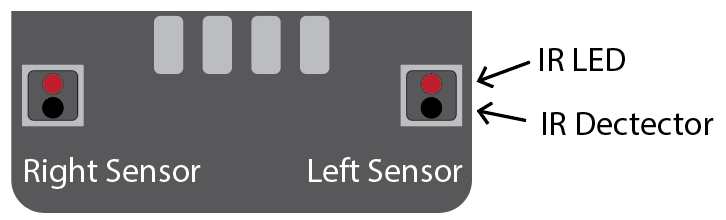
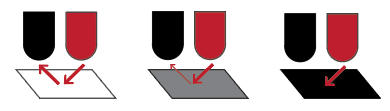
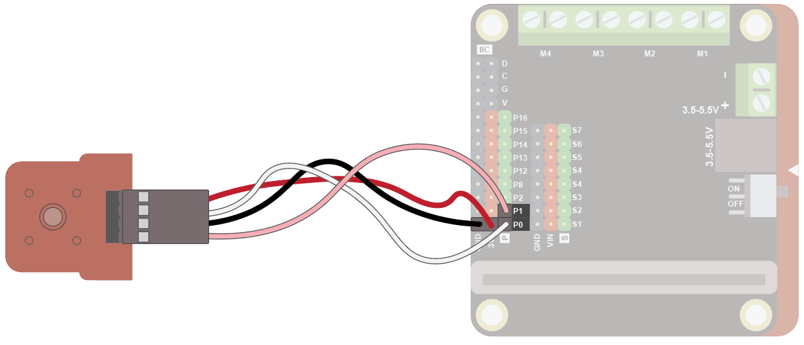
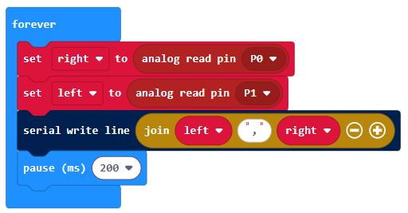
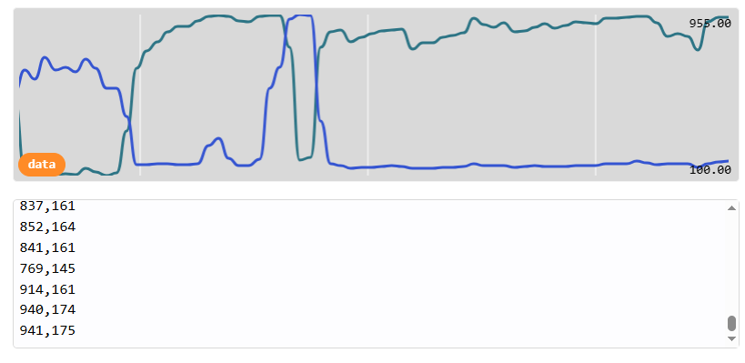
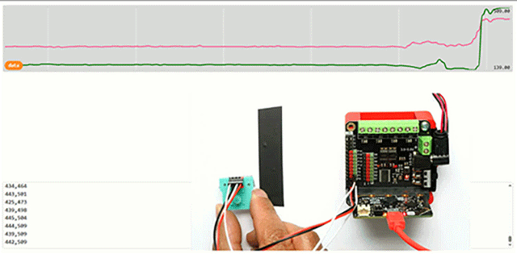

#### line follow sensor
The line following sensor can detect light or dark areas in close proximity. There are 2 sensors, allowing a reading on the left and right.

The line following sensor is primarily used to create line following robots.

#### Quick Reference
### What is it
The line following sensor is actually made up of two light sensors and two lights:

The light is an Infrared (IR) light. This is a light that can’t be seen by humans, but can be detected by an IR sensor. The light will reflect off a white surface, but with darker surfaces, less light is reflected. A totally black surface will not reflect any light. The IR detector will detect this difference in reflected light.

### Wiring
Use a special cable to connect the sensor. This has 4 wires, white, pink, red and black:

Wire up as follows, using the Edge Connector or Motor Controller board:

| Numeric Display | Microbit | Purpose      |
| :-------------- | :------- | :----------- |
| Red             | 3V3      | Power        |
| Black           | GND      | Ground       |
| Pink            | P1       | Left sensor  |
| White           | P0       | Right sensor |

On the Motor Controller Board it should look like this:

### Coding
Enter this code in the forever block:

Download the code to the microbit.

The code creates reads the left and right sensor and shows the values in the data window.

To see the data, click on Show data Device:

You should see some numbers and a graph. These show the amount of light falling on the sensor:

Move the sensor over a black line about 1cm thick on a white sheet of paper. Notice how the left and right readings change, with high values when the sensor is over a white area and low values with the sensor is over a dark area:

By comparaing the two values you can find out where the line is.

This sensor is used in the <a href="assets/pins-short.png" target="_blank">line following robot activity</a>.

 