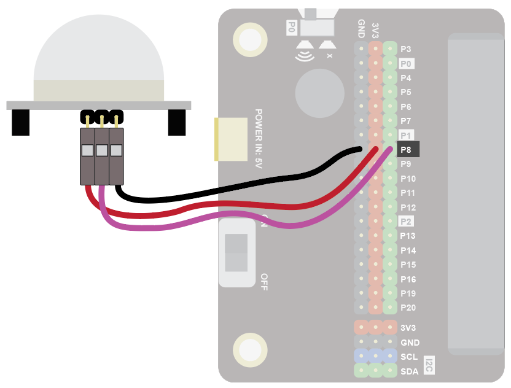
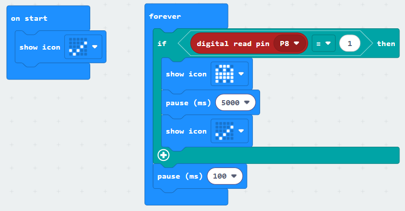
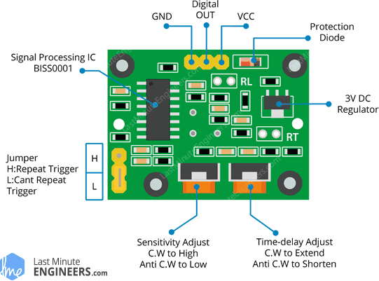

A motion sensor, or PIR, detects infra-red radiation (it does it passively, so it’s called a Passive Infrared or PIR). The hotter something is the more IR radiation it emits. PIRs can detect when the amount of IR radiation changes in their zone of detection.

They are used to detect human presence, for example in burglar alarms.

## Wiring
Use individual wires to connect the sensor as follows:

| Motion Sensor   | Microbit           |
| :-------------- | :----------------- |
| VCC             | 3V3                |
| OUT             | P8                 |
| GND             | GND                |

On the Edge Connector it should look like this:

Note that you can pop the dome cover off the sensor to reveal the pin labels!

You don't have to use pin P8. You can use any <a href="../../../assets/pins-short.png" target="_blank">digital pin</a>. Just remember to adjust your code accordingly.

## Coding
Enter this code:

Download the code to the microbit.

Cover the sensor with a cup (not your hands, which are warm and will trigger the sensor!).

Wait around 60 seconds for the PIR to warm up. The microbit should be showing a tick.

Uncover the sensor. It should detect you and show the ghost symbol on the microbit.

## Adjustment
You may need to adjust sensitivity and the time delay if the PIR does not respond correctly.

<a href="https://www.electronicwings.com/sensors-modules/pir-sensor" target="_blank">See here for more guidance.</a>

 
