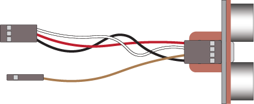
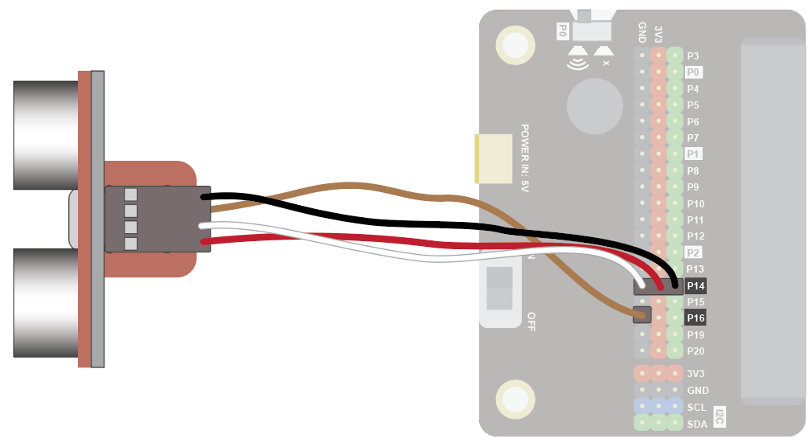
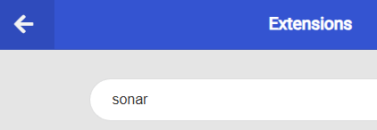
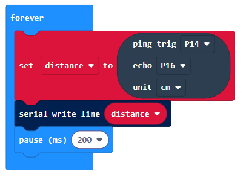
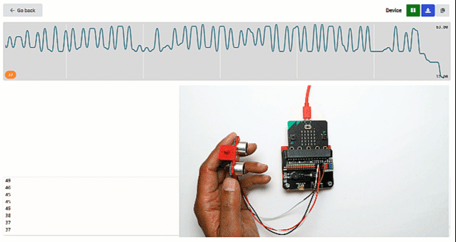
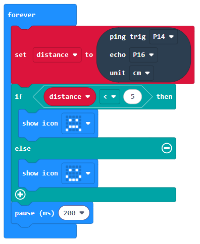

### Ultrasonic-Sensor
The ultrasonic sensor can be used to measure distances

Use it to prevent robots from crashing, detect people approaching and much more!

#### Tutorial
Watch this video for a complete tutorial:

#### Quick Reference
#### Wiring
Connect the special cable to the ultrasonic sensor. The red wire should connect to the VCC pin:

{ width=400}

Attach the cable to the Edge Connector or Motor Controller board as follows:

| Ultrasonic       | Microbit           | Purpose                          |
|------------------|--------------------|----------------------------------|
| Trig (white wire)| P14 3-pin connector| Trig (make an ultrasound signal) |
| Echo (brown wire)| P16                | Echo (listen for an ultrasound signal) |

{width = 600}

You don't have to use pins P14 and P16. You can use any <a href="assets/pins-short.png" target="_blank">Digital pin</a>.. Just remember to adjust your code accordingly.

#### Coding
Add this extension:

Enter this code in forever:

The Serial blocks can be found in Advanced.

Download the code to the microbit.

To see the data, click on Show data Device:

You should see some numbers and a graph. These show the distance readings in cm. Place you hand in front of the sensor and move it back and forth. The readings should show how far your hand is from the sensor.

You could also try this, to show when an object approaches close to the sensor:

 