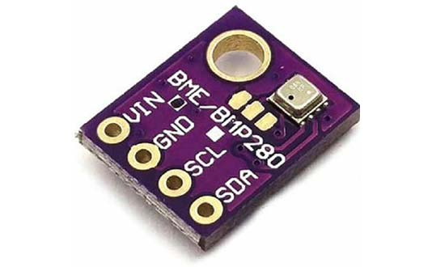
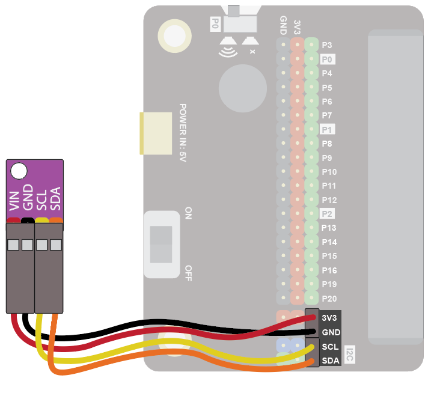
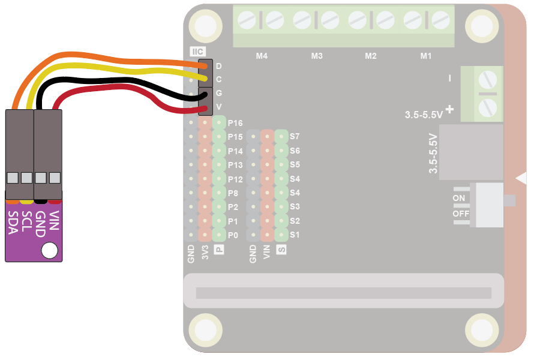
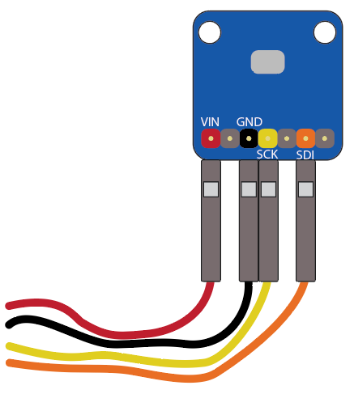
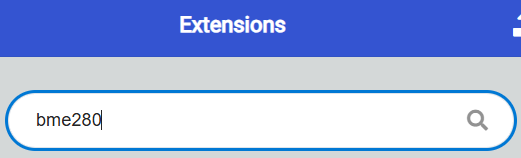
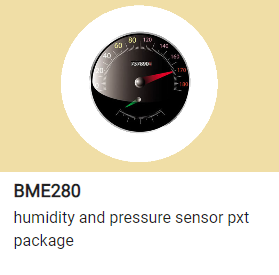
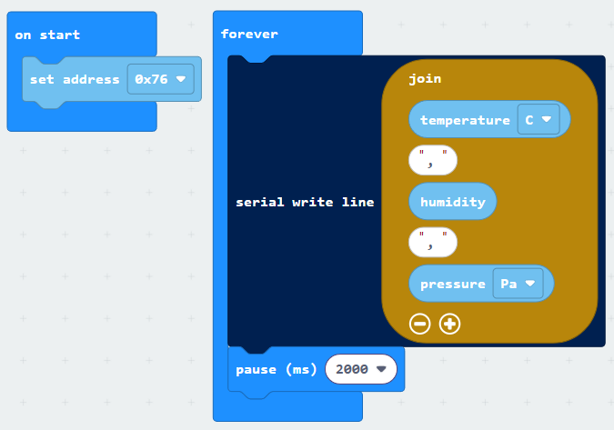
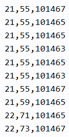

The BME 280 weather sensor can read temperature, pressure and humidity.

## Wiring
Use the I2C cable to connect the sensor.  This has 4 wires in 2 pairs: orange-yellow and red-black:

{ width=400 }

Wire up as follows, using the Edge Connector or Motor Controller board:

|Weather Sensor     | Wire colour           | Edge Connector | Motor Controller |
| :---------------- | :-------------------- | :------------- | :--------------- |
|VIN                | Red                   | 3V3            | V                |
|GND                | Black                 | GND            | G                |
|SCL                | Yellow                | SCL            | C                |
|SDA                | Orange                | SDA            | D                |

On the edge connector it should look like this:

{ width=600 }

On the motor controller it should look like this:

{ width=600 }

If you are using the Adafruit weather sensor, the wiring is a little different:

{ width=400 }

|Adafruit Weather Sensor | Wire colour           | Edge Connector | Motor Controller |
| :---------------- | :-------------------- | :------------- | :--------------- |
|VIN                | Red                   | 3V3            | V                |
|GND                | Black                 | GND            | G                |
|SCK                | Yellow                | SCL            | C                |
|SDI                | Orange                | SDA            | D                |

## Coding

You will need to add an extension to get additional blocks for the sensor.  Click on the extensions block:

Then search for "bme280":

Then click on the **BME280** extension:

You should see a new block appear:

Enter this code:

If you are using the Adafruit sensor, set the address to 0x77.

Download the code to the microbit.

To see the data, click on Show data Device:

You should see some numbers and a graph. These show the temperature, humidity and pressure.  Warm the sensor in your hands to see the temperature change.  Breathing on it should increase the humidity. 

 
