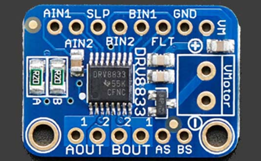
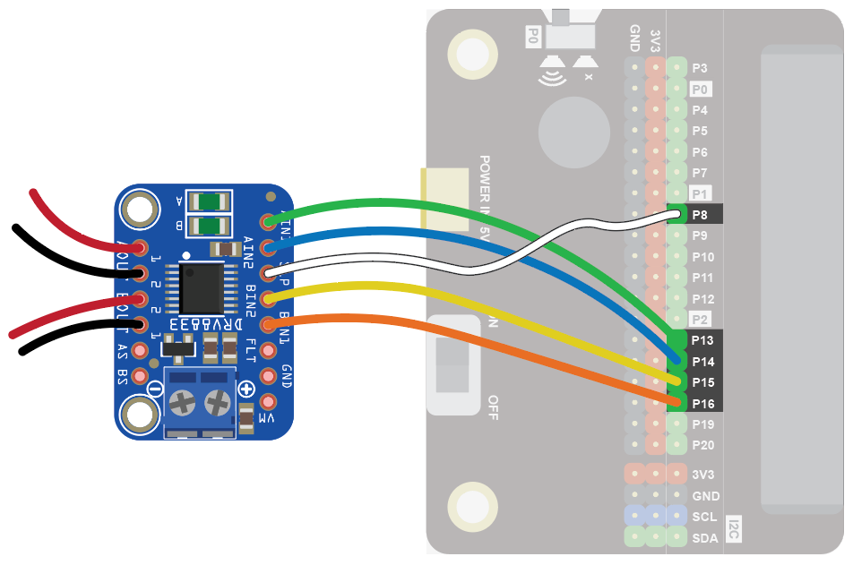
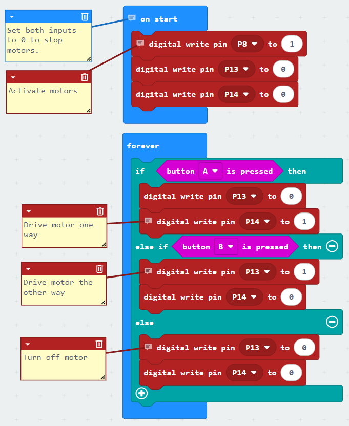
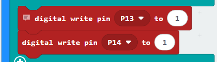
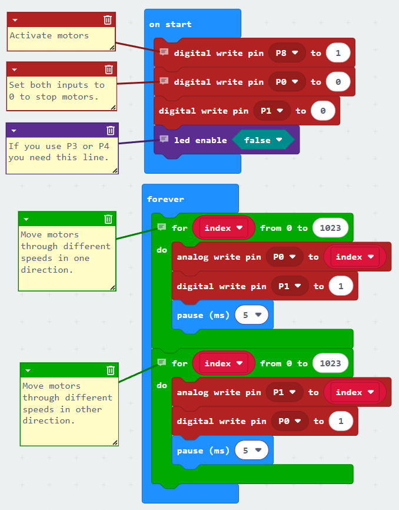
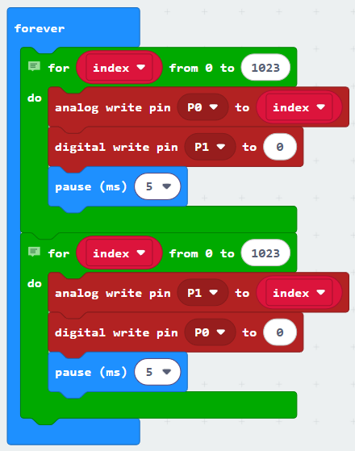

### DC Motors with the DRV8833
The DRV8833 is a very efficient motor driver board that can drive one or two DC motors with a range of voltages from 2.7V to 10.8V.

#### Wiring
Use female-female cables to connect the DRV8833 to the Edge Connector.  Then connect the motors.  If you want just one motor, use the A pins.  If you want two motors use A and B.
The SLP connection turns the motors on and off.

Wire up as follows, using the Edge Connector board:

|DRV8833          | Purpose            | Microbit             |
| :-------------- | :----------------  | :------------------  |
|AIN1             | Control motor A    |P13                   |
|AIN2             | Control motor A    |P14                   |
|BIN1             | Control motor B    |P15                   |
|BIN2             | Control motor B    |P16                   |
|SLP              | Turn motors on/off |P8                    |

|DRV8833          | Purpose            | Motors               |
| :-------------- | :----------------  | :------------------  |
|AOUT1            | Drive motor A      |One wire on motor A   |
|AOUT2            | Drive motor A      |Other wire on motor A |
|BOUT1            | Drive motor B      |One wire on motor B   |
|BOUT2            | Drive motor B      |Other wire on motor B |

{ width=600 }

You don't have to use the above Microbit pins.  You can use any <a href="../../../assets/pins-short.png" target="_blank">digital pin</a>.  Just remember to adjust your code accordingly.

#### Coding

Enter this code:

Download the code to the microbit.

Press the A button.  The motor should turn.  Press the B button.  The motor should turn the other way.

Note that if you write 1 to both pins instead of 0, the motor will brake rather than slow down.  This doesn't work with all motors, so try it out.

#### Speed Control
You can also vary the speed of the motors by connecting the DRV8833 to analogue pins instead of digital ones.

Wire up as follows, using the Edge Connector board:

|DRV8833          | Purpose            | Microbit             |
| :-------------- | :----------------  | :------------------  |
|AIN1             | Control motor A    |P0                    |
|AIN2             | Control motor A    |P1                    |
|BIN1             | Control motor B    |P2                    |
|BIN2             | Control motor B    |P3                    |
|SLP              | Turn motors on/off |P8                    |

|DRV8833          | Purpose            | Motors               |
| :-------------- | :----------------  | :------------------  |
|AOUT1            | Drive motor A      |One wire on motor A   |
|AOUT2            | Drive motor A      |Other wire on motor A |
|BOUT1            | Drive motor B      |One wire on motor B   |
|BOUT2            | Drive motor B      |Other wire on motor B |

Use the following code example to guide you:

Note that if you write 0 to the other pin instead of 1, the motor will brake rather than slow down.  This doesn't work with all motors, so try it out.

 
