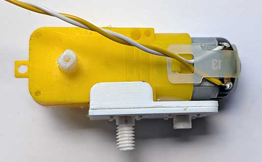
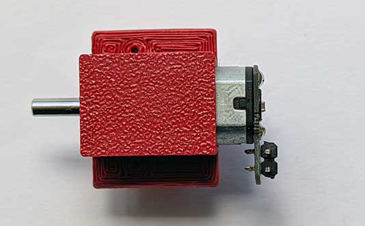
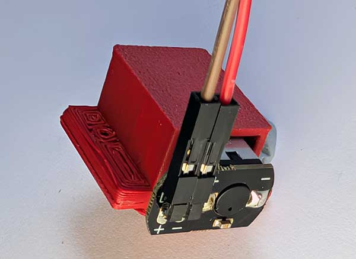
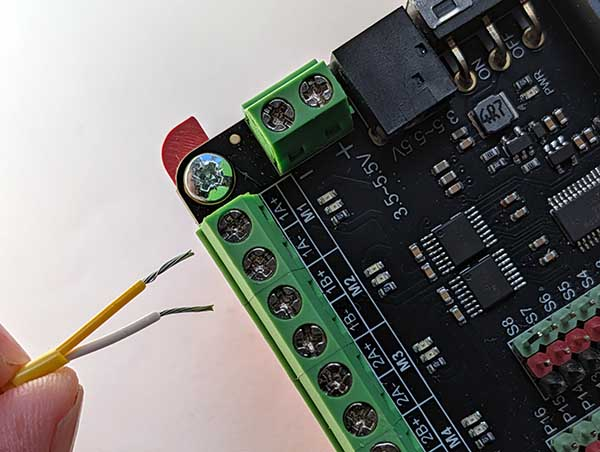
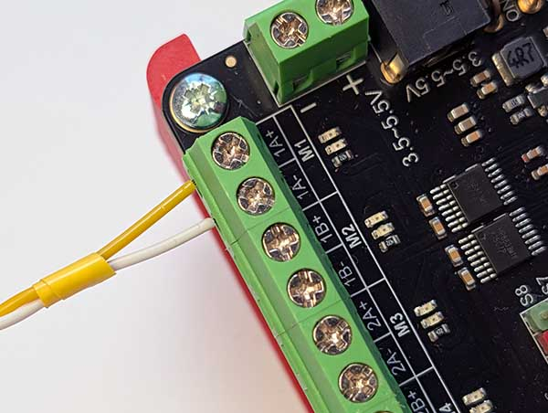
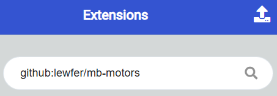
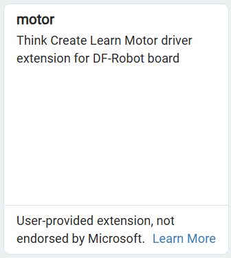
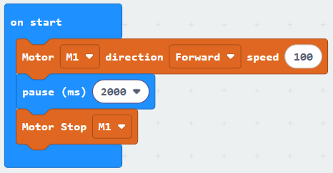

DC motors (or just “motors”) can spin when a current is applied. By reversing the current the motor spins in the opposite direction. By changing the voltage the motor spins faster or slower. The Motor Controller board handles the speed and direction control for us.

These come in various shapes and sizes and have 2 wire connections, which might be attached wires or pins on which you can attach the wires.

## Wiring
If your motor has bare pins, attach some wires to them:

Connect the loose wires to the Motor Controller.  To do so, unscrew the terminals for the required motor connection (M1, M2, M3 or M4), insert the wires, and then tighten the screws.

Note that if, when running the code, the motor runs the wrong way, you can swap the wires around here to fix the issue.

## Coding 
To use the motors you need to add the extension.

To add the extension, first click on Extensions:

{ width=400 }

Then enter the URL for the extension:

Then click on the extension:

You should see the following block:

Enter the following code:

Download the code to the microbit.

The motor should move forwards for 2 seconds and then stop.

