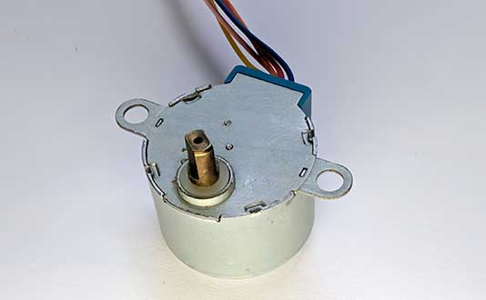
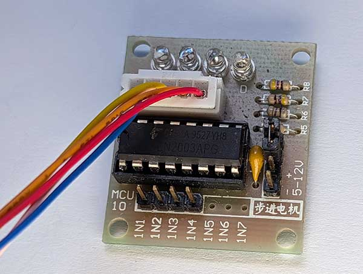
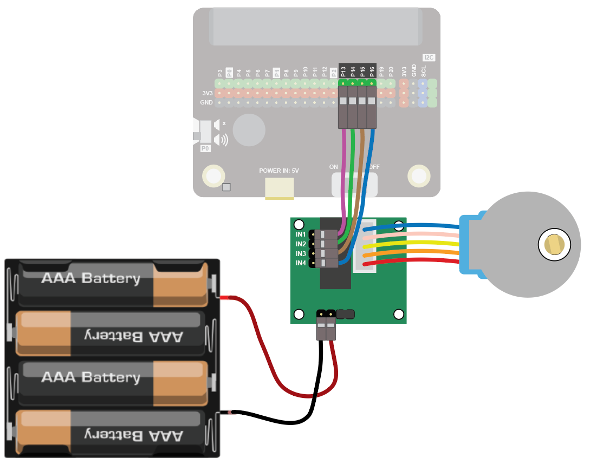
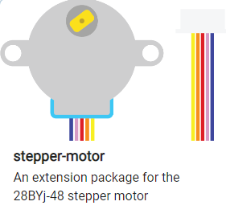
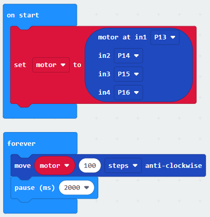

Stepper motors give you a very precise movement of a number of steps. They are used in things like 3D printers, CNC machines, etc.

Stepper motors can be expensive. A cheap option is the 28BYJ-48. It can’t be driven from the standard motor connections on the Kitronik, but it comes with its own motor driver board.

## Wiring
Connect the multi-coloured cable from the motor to the special motor driver:

Using female-female wires, connect the pins on the motor driver to the microbit as follows:

| Stepper  | micro:bit Connection              |
| :------- | :-------------------------------- |
| IN1      | P13                |
| IN2      | P14 |
| IN3      | P15 |
| IN4      | P16 |

The stepper motor uses a lot of power, so connect 4xAA batteries to the power connector on the motor driver.

The completed wiring should look like this:

{ width=600 }

## Coding
To use the stepper motor you need to add the extension.

To add the extension, first click on Extensions:

{ width=400 }

Then find and click on the extension:

You should see the following block:

Enter the following code:

Download the code to the microbit.

The motor should turn 100 steps.

