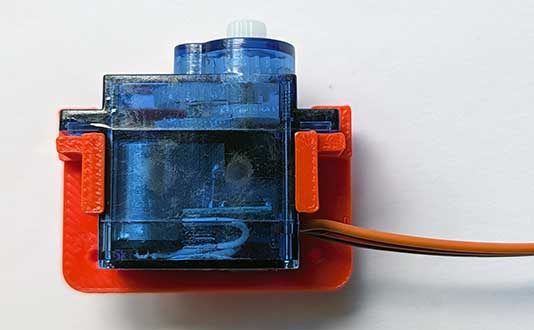
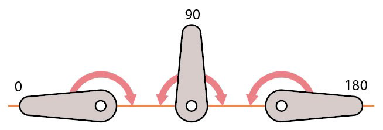
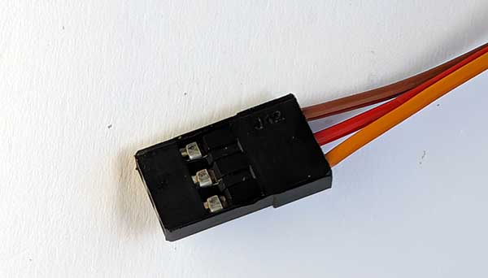
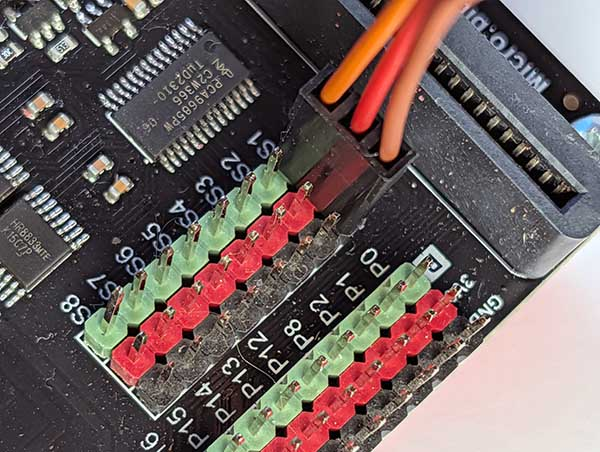
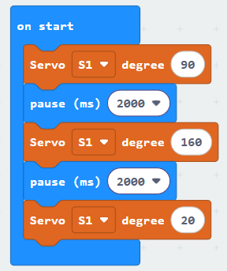

Servo motors generally are designed to move to any angle between 0 and 180 degrees.

Use them where reasonably precise positioning of the motor is required, for example to control a lever or operate a robot arm.

## Wiring
Servo motors have 3 wires connected together in a single cable:

The middle red wire is for power.  The brown wire is for GND.  The orange (or sometimes yellow) wire is for the signal.

Connect the cable to the special connectors, marked S1, S2 etc, on the Motor Controller:

Make sure to connect the orange/yellow wire to the green pin and the brown wire to the black pin.

## Coding
To use the servo motor you need to add the extension.

To add the extension, first click on Extensions:

{ width=400 }

Then enter the URL for the extension:

Then click on the extension:

You should see the following block:

Enter the following code:

Download the code to the microbit.

The motor should move between 3 angles: 90 degrees, 160 degrees and 20 degrees.

Note that although most servo motors claim to run between 0 and 180 degrees, many don't work well or may even lock up at the far ends of the range.  So generally it makes sense to limit the angles to between 20 and 160 degrees.

