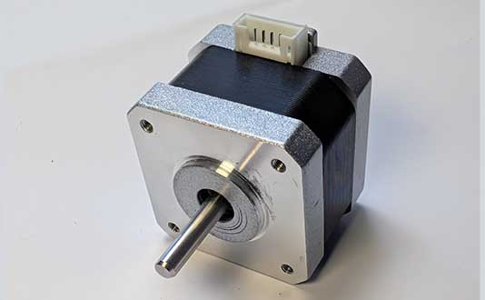
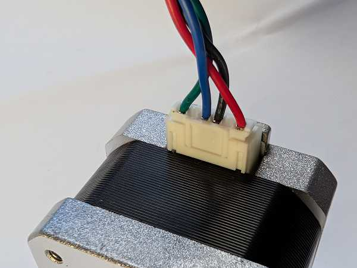
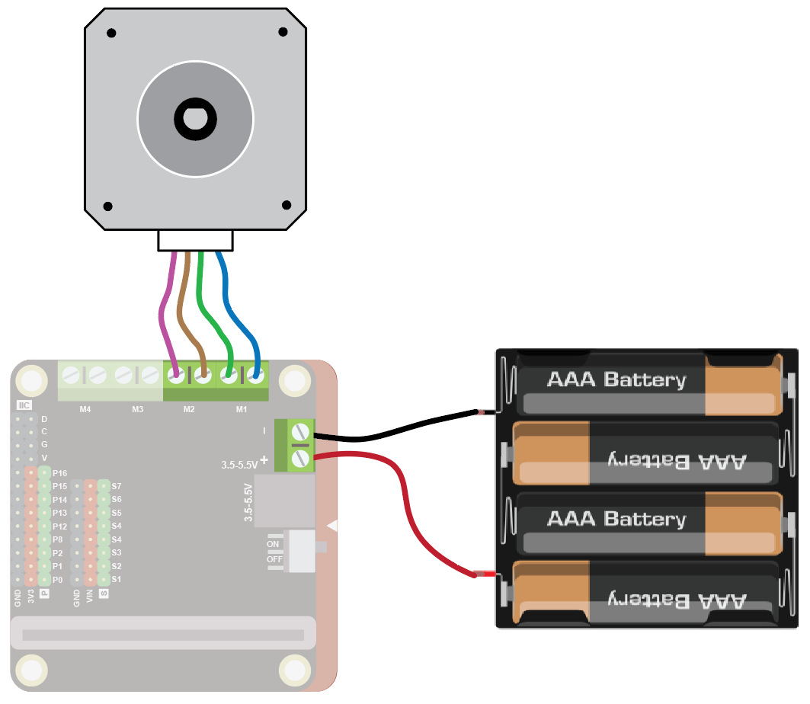
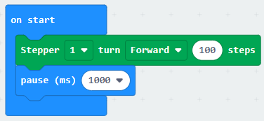

Stepper motors give you a very precise movement of a number of steps. They are used in things like 3D printers, CNC machines, etc.

## Wiring
Steppers have 4 wires, which may be already attached to the motor, or you may need to plug them in:

The wires come in two pairs.  You need to identify the matching pairs.  These may be marked, or you can use the continuity/buzz or resistance feature of a multimeter to find matching pairs.  You should get a buzz or a 0 resistance for matching pairs:

We will use the Motor Controller to drive the motor.  Connect one wire pair to M1 and the other to M2:

The stepper motor uses a lot of power, so connect 4xAA batteries to the power connector on the motor driver.

## Coding 
To use the motor you need to add the extension.

To add the extension, first click on Extensions:

{ width=400 }

Then enter the URL for the extension:

Then click on the extension:

You should see the following block:

Enter the following code:

Download the code to the microbit.

The motor should move forwards for 100 steps and then stop.