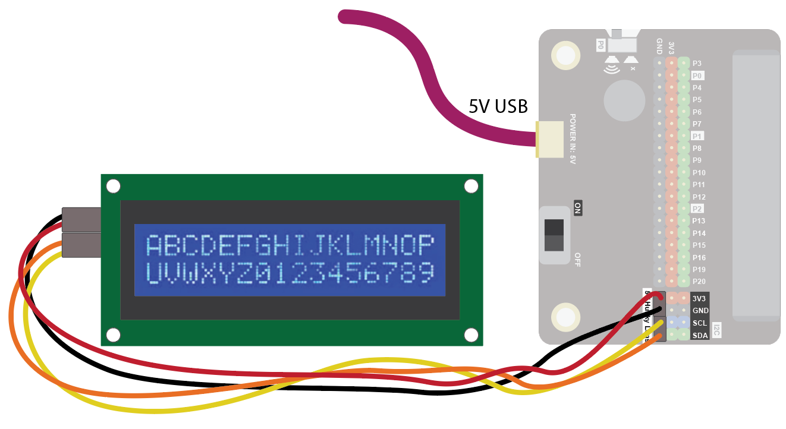
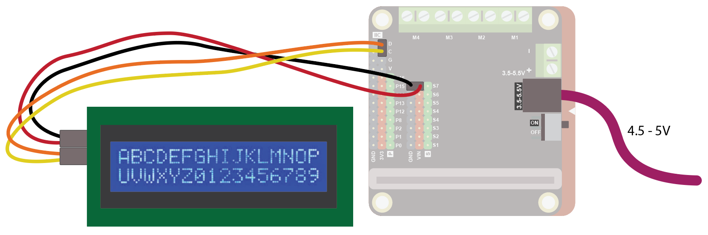
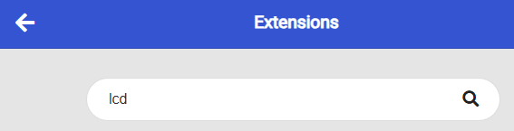
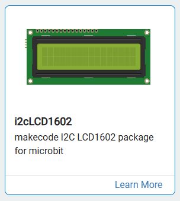
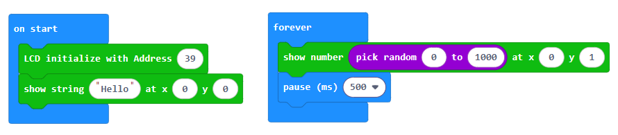
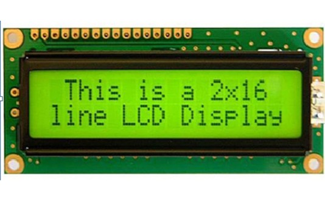
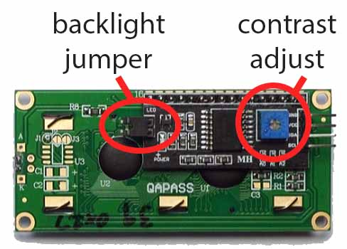

### 16x2 LCD Display
The 16x2 LCD Display can be used to display two lines of 16 characters.
Use it to display short messages!
 
### Quick Reference
## Wiring
Use the I2C cable to connect the sensor. This has 4 wires in 2 pairs: orange-yellow and red-black:
 

 
Wire up as follows, using the Edge Connector or Motor Controller board:
 
| **16x2 LCD Display** | **Edge Connector** | **Motor Controller** |
| :------------------- | :----------------- | :------------------- |
| Red                  | 5V                 | Vin                  |
| Black                | GND                | G                    |
| Yellow               | SCL                | C                    |
| Orange               | SDA                | D                    |
 
Note that the LCD display needs arounf 4.5 - 5V to work well, but the Microbit only gives 3.3V. So we need to ensure we add additional power.
 
On the edge connector wire it like this, using the 5V "Husky Lens" pins to connect the display and an additional 5V power from a USB input (this can come from a USB port on your computer or a USB power bank):
 

 
On the motor controller wire it like this, using the servo connector GND and VIN pins, and a power input such as 3AA batteries:
 

 
Coding
You will need to add an extension to get additional blocks for the display. Click on the extensions block:
 

 
Then search for "lcd":
 

 
Then click on the i2cLD1602 extension:
 

 
You should see a new block appear:
 

 
Enter this code in on start and forever blocks:
 

 
Download the code to the microbit.
 
The code will show "Hello" on the top line and a random number on the bottom line. The random number changes every half second:
 

 
Note that if the message is not displaying clearly, you can adjust the blue screw on the back of the display to control the contrast. The backlight jumper needs to be present for the backlight to be on:
 

 
 