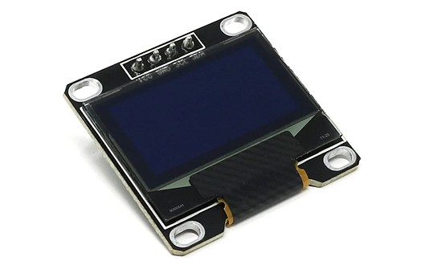
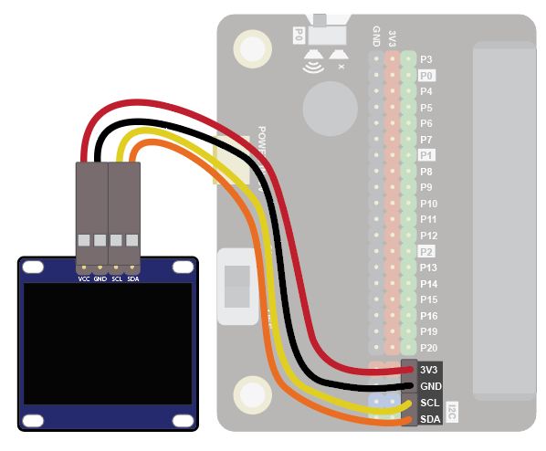
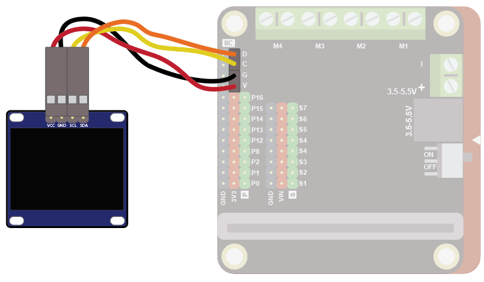
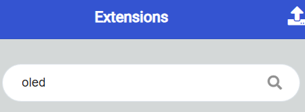
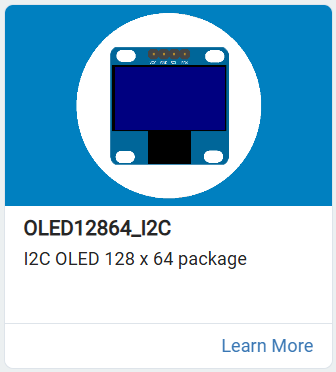
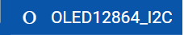
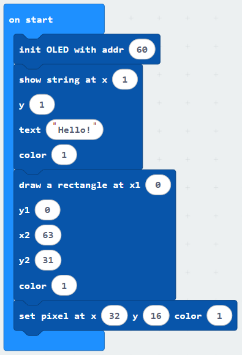
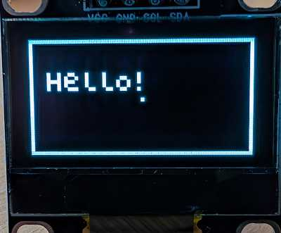
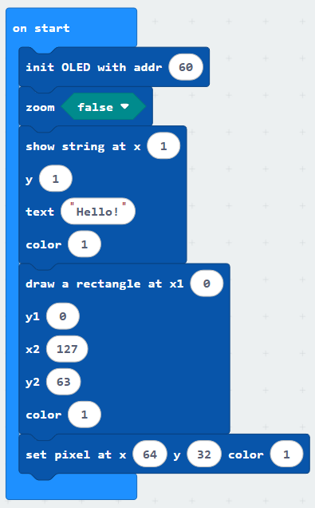
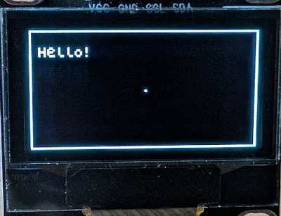

The OLED screen is a small 128x64 pixel display that can be used to display monochrome text and graphics.

Use it to display messages and images on a range of projets.

### Wiring
Use the I2C cable to connect the sensor. This has 4 wires in 2 pairs: orange-yellow and red-black:

Wire up as follows, using the Edge Connector or Motor Controller board:

| OLED         Display | Suggested wire colour | Edge Connector | Motor Controller |
| :------------------- | :-------------------- | :------------- | :--------------- |
| VCC                  | Red                   | 3V3            | V                |
| GND                  | Black                 | GND            | G                |
| SCL                  | Yellow                | SCL            | C                |
| SDA                  | Orange                | SDA            | D                |

On the edge connector it should look like this:

On the motor controller it should look like this:

#### Coding
You will need to add an extension to get additional blocks for the display. Click on the extensions block:

Then search for "lcd":

Then click on the OLED12864_I2C extension:

You should see a new block appear:

Enter this code in on start block:

Download the code to the microbit.

The code shows a simple message in a rectandle, with a dot in the middle of the screen:

By default, the extension puts the display in "zoom" mode, which reduces the resolution to 64x32.  This lower resolution reduces the amount of memory needed for the display.

You can switch off zoom mode and get the full 128x64 resolution, but of course text and pixels will be smaller:

 